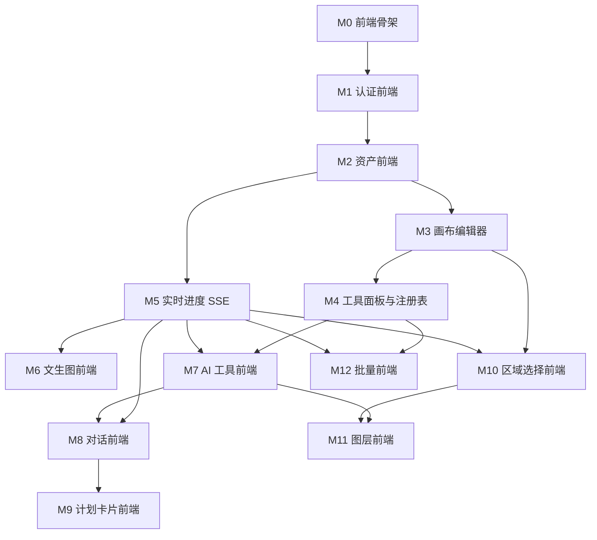

# 复现路线图（前端视角）

> **后端采用项目原有实现，你只实现前端。**
> 这是**第一级需求**：粗粒度模块清单。唯一作用是划清模块边界、确定复盘节点。
> 每个模块开工前，用 [`PRD-TEMPLATE.md`](./PRD-TEMPLATE.md) 写该模块的详细 PRD（第二级），建议存放在 `prd/M<编号>-<模块名>.md`。

## 源码边界（现在最重要的一条纪律）

| 范围 | 能否看 | 说明 |
| --- | --- | --- |
| **后端源码** | ✅ 看 | 它是你要对接的「接口文档」 |
| **前端源码** | ❌ 禁止 | 它是你的**考题**，复盘前一眼都不能看 |
| README 能力介绍 | ✅ 看 | 需求素材 |
| 跑起来的成品 | ✅ 看 | 正常竞品调研 |

> 后端源码和前端源码在同一个仓库里，你会非常顺手地翻过去。这条边界必须自己守死。

## 三条铁律

1. **设计阶段不看前端源码。** 先输出自己的方案。
2. **卡住才查，带着问题查那一个点**，看完立刻关掉，用自己的设计继续写。
3. **每个模块做完必须产出复盘笔记**（差异清单）。没有笔记的复盘等于没复盘。

## 模块总表（前端，M0–M12）

| 编号 | 模块 | 一句话功能 | 依赖 | 规模 | 后端依赖（已提供） | 复盘重点 |
| --- | --- | --- | --- | --- | --- | --- |
| **M0** | 前端骨架 | Vite + React + TS 工程、路由、开发代理、请求层、状态管理选型、目录约定 | — | S | 健康检查接口 | 请求层的错误与认证失效如何统一抽象；代理为何与 Cookie 同源相关 |
| **M1** | 认证前端 | 登录/注册页、会话维持、路由守卫、未登录跳转 | M0 | S | auth 路由 | 为何用 httpOnly Cookie（前端拿不到 token）；前端如何感知登录失效 |
| **M2** | 资产前端 | 上传组件、资产列表、图片展示、删除 | M1 | M | assets 路由 | 签名 URL 有时效，前端是否需要刷新；上传直传 vs 经后端 |
| **M3** | 画布编辑器 | Konva 舞台：视口缩放平移、位图图层、单选/框选、变换、撤销重做、前后对比、导出 | M2 | L | assets 图片数据 | 视口状态与文档状态如何分离；撤销重做用命令模式还是快照；预览态与提交态边界 |
| **M4** | 工具面板与工具注册表 | 由工具元信息驱动的参数表单、工具调用、结果写回图层 | M3 | L | 工具元信息 + 执行接口 | **注册表如何一处定义同时服务 UI 与 Agent**（最核心设计）；参数表单如何由元信息生成 |
| **M5** | 实时进度（SSE） | SSE 订阅 hooks、断线重连、进度 UI、失败/完成态 | M2 | M | `/events` + 任务状态 | 进度如何跨进程汇聚推送；为何不轮询；重连时如何补齐状态 |
| **M6** | 文生图前端 | 提示词输入、生成中进度、四宫格候选、选图进入编辑器 | M5 | M | 文生图任务接口 | 候选图与任务的关联；生成中的交互禁用与取消 |
| **M7** | AI 工具前端 | 抠图/换背景/扩图/超分等工具的参数交互与结果呈现 | M4, M5 | M | 对应工具接口 | 耗时工具如何复用同一套进度 UI；失败与降级提示 |
| **M8** | 对话前端 | 对话界面、消息流、输入框、等待态、工具调用结果回显 | M5, M7 | M | 会话/消息接口 | 消息与工具执行的映射；流式与非流式体验差异 |
| **M9** | 计划卡片前端 | 多步计划展示、依赖关系可视化、确认/单步重试/取消 | M8 | L | 计划接口 | 计划数据结构如何驱动 UI；人机协作的交互节点插在哪一步 |
| **M10** | 区域选择前端 | SAM 点选交互、笔刷涂抹、选区可视化、局部编辑入口 | M3, M5 | L | 选区/局部编辑接口 | embedding 缓存对交互响应的影响；选区数据如何进入图层系统 |
| **M11** | 图层前端 | 图层树、拆分入口、图层独立操作、图层状态呈现 | M7, M10 | M | 图层 JSONB 接口 | 图层 JSONB 结构取舍；切换图片再切回为何结构不丢 |
| **M12** | 批量前端 | 批量任务提交、批量进度聚合、批量结果查看 | M4, M5 | M | 批量接口 | 批量进度如何聚合推送；单条失败对整体的影响 |

> 规模：S ≈ 数天，M ≈ 一到两周，L ≈ 两周以上（业余时间，仅作相对参考）。
>
> **M3 与 M4 是两个分水岭**：M3 决定你有没有一个真能用的编辑器；M4 的工具注册表是全局最核心设计。这两块复盘请多花时间。

## 后端能力（已提供，仅需理解，不实现）

后端由项目原有实现提供。你不写它，但**必须能讲清它**——否则面试时这个项目会变成减分项。

| 领域 | 后端已提供 | 你需要理解到什么程度 |
| --- | --- | --- |
| 认证 | 注册/登录/注销/当前用户，JWT 存 httpOnly Cookie | 能讲清为何用 Cookie 而非 Bearer Token |
| 资产 | 上传、签名 URL、资产列表与删除 | 能讲清签名 URL 时效与 public endpoint 为何分离 |
| 异步与推送 | ARQ Worker + Redis Pub/Sub + SSE `/events` | 能讲清一次耗时任务从提交到推送前端的完整链路 |
| 编辑工具与注册表 | 工具元信息 + 执行接口 | 能讲清注册表为何一处定义同时服务 UI 与 Agent |
| AI 能力 | 文生图 / 抠图 / 换背景 / 扩图 / 超分，Provider 抽象（mock / 真实） | 能讲清 Provider 抽象带来的收益 |
| Agent | 规划模型接入、工具签名绑定、LangGraph 编排 | 能讲清一句自然语言如何变成工具调用序列 |
| 多步计划 | 服务端校验、依赖补全、环检测、拓扑排序 | 能讲清服务端为何不能信任模型输出 |
| 区域与局部编辑 | SAM 点选、inpainting | 能讲清 embedding 缓存为何让首次慢、后续毫秒级 |
| 图层 | 拆分、JSONB 持久化 | 能讲清 JSONB 结构取舍与为何切换图片不丢 |
| 批量 | 批量任务与并发控制 | 能讲清批量进度如何聚合推送 |

**面试最低要求**：不看代码讲清「一次 AI 修图请求的完整链路」，以及上表每一项的**为什么这么设计**。

> 好消息：你写前端时要反复对接这些接口，会**免费**获得大部分理解。只需有意识地把它们补成「能讲」的程度。

## 依赖关系



## 推荐推进顺序

| 阶段 | 模块 | 里程碑 |
| --- | --- | --- |
| 一、地基 | M0 → M1 → M2 | 前端能跑，能登录、能传图 |
| 二、编辑器 | M3 → M4 | **里程碑 A**：可用的图片编辑器，含工具与图层 |
| 三、实时与 AI | M5 → M6 → M7 | **里程碑 B**：AI 能力 + 实时进度 |
| 四、智能体界面 | M8 → M9 | **里程碑 C**：对话修图 + 计划确认 |
| 五、进阶 | M10 → M11 → M12 | **里程碑 D**：差异化能力 |

> M5 只依赖 M2，若想先验证 SSE 链路可提前；但先做 M3/M4 能更早拿到视觉正反馈。

## 进度清单

```
阶段一  地基
- [ ] M0 前端骨架
- [ ] M1 认证前端
- [ ] M2 资产前端

阶段二  编辑器
- [ ] M3 画布编辑器
- [ ] M4 工具面板与工具注册表
        ☑ 里程碑 A

阶段三  实时与 AI
- [ ] M5 实时进度（SSE）
- [ ] M6 文生图前端
- [ ] M7 AI 工具前端
        ☑ 里程碑 B

阶段四  智能体界面
- [ ] M8 对话前端
- [ ] M9 计划卡片前端
        ☑ 里程碑 C

阶段五  进阶
- [ ] M10 区域选择前端
- [ ] M11 图层前端
- [ ] M12 批量前端
        ☑ 里程碑 D
```

## 每个模块的三段式循环

严格分离，不要串味：

1. **设计**（禁止看前端源码）→ 产出模块 PRD
2. **实现**（禁止看前端源码，卡住才查那一个点）→ 产出可运行代码
3. **复盘**（做完后打开前端源码找差异）→ 产出差异清单笔记

自测标准：**这个模块的设计决策，我能不看代码给另一个人讲明白吗？** 讲不明白说明是抄的，回去补第三段。
